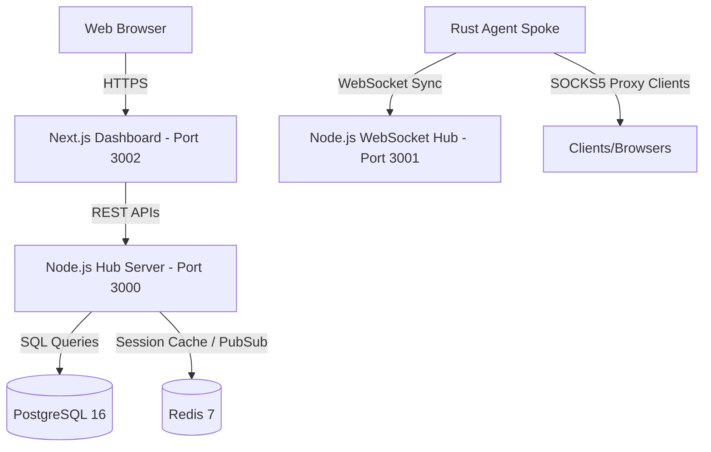

# SockPit Deployment & Windows Binary Build Guide

This comprehensive guide walks you through deploying the **SockPit** server stack (REST API, WebSocket, Redis, PostgreSQL, and Next.js Dashboard) and building/installing the Windows SOCKS5 Agent Binary (`sockpit-agent.exe`) with administrator privilege embedding.

---

## 1. System Architecture

SockPit operates on a Hub-and-Spoke model:
- **Hub**: Running PostgreSQL, Redis, Node.js API, and a Next.js frontend dashboard.
- **Spokes (Agents)**: High-performance Rust SOCKS5 daemons deployed on Linux hosts (via systemd), Windows hosts (via Windows Services), or Docker containers.



---

## 2. Prerequisites

Ensure the following tools are installed on your deployment host:
1. **Docker** and **Docker Compose** (version 2.0 or higher).
2. **Node.js** v20+ (optional: for local development running outside Docker).
3. **Rust & Cargo** (optional: only required on the machine compiling the agent).

---

## 3. Hub Server Stack Deployment (Linux/Docker)

### Step 1: Clone the Repository & Configure Environment
Navigate to the root directory and copy the environment template:
```bash
cp .env.example .env
```

Edit the `.env` file to customize passwords and keys:
- `JWT_SECRET`: Generate a secure, 32-character string for JWT signing.
- `ENCRYPTION_KEY`: A 32-byte (64 hex characters) key used to encrypt/decrypt SOCKS5 passwords in-database and in-transit.
- `DASHBOARD_URL`: Set to the public or host URL of the dashboard (e.g. `http://localhost:3002`).

### Step 2: Prepare Backend DB Migrations
The Node server container will automatically apply PostgreSQL migrations on startup, but you can also manually verify migrations if running locally:
```bash
cd server
npm install
npm run migrate up
```

### Step 3: Launch Production Stack
Build and start the services using the production compose file:
```bash
docker compose -f docker-compose.prod.yml up -d --build
```

This brings up:
- **Postgres Database** (`sockpit-postgres-prod`) on port `5432` (internal).
- **Redis Cache** (`sockpit-redis-prod`) on port `6379` (internal).
- **REST & WS Server** (`sockpit-server-prod`) on port `3000` (API) and `3001` (WebSocket).
- **Next.js Dashboard** (`sockpit-dashboard-prod`) on port `3002`.

### Step 4: Verify Services Status
Check if all services are online and healthy:
```bash
docker compose -f docker-compose.prod.yml ps
```

---

## 4. Building the Windows Agent Binary (`sockpit-agent.exe`)

The Windows agent compiles into a single executable that integrates with the Windows Service Control Manager and embeds a **UAC Application Manifest** requiring Administrator elevation.

### Method A: Compile Natively on Windows (Recommended)
1. **Install Rust**: Download and run the rustup installer from [rustup.rs](https://rustup.rs/). Choose the `x86_64-pc-windows-msvc` toolchain.
2. **Install Build Tools**: Ensure the Visual Studio Build Tools with C++ workload is installed (requested automatically by Rust installer).
3. **Navigate to Agent Directory**:
   ```powershell
   cd .\agent
   ```
4. **Compile Release Binary**:
   ```powershell
   cargo build --release
   ```
5. **Output Path**: The compiled executable will be located at:
   ```path
   .\agent\target\release\sockpit-agent.exe
   ```

### Method B: Build using GitHub Actions (Automated & Recommended)
The repository is pre-configured with a CI/CD workflow at [`.github/workflows/build-agent.yml`](file:///root/sockpit/.github/workflows/build-agent.yml) that builds both Windows and Linux binaries automatically.

#### Step 1: Push the Code to GitHub
Ensure the workspace is pushed to your remote GitHub repository:
```bash
git init
git add .
git commit -m "Initialize project with Windows UAC elevation and services"
git remote add origin <your-github-repo-url>
git branch -M main
git push -u origin main
```

#### Step 2: Trigger the Workflow
You can trigger the workflow in two ways:

- **Option 1: Manual Trigger (GitHub UI)**:
  1. Go to your repository on GitHub.
  2. Click on the **Actions** tab.
  3. Under "Workflows" in the sidebar, select **Build & Release Agent**.
  4. Click **Run workflow** -> Select branch `main` -> Click **Run workflow** button.

- **Option 2: Git Tag Push (Automatic)**:
  Create and push a version tag to trigger the builder job automatically:
  ```bash
  git tag v1.0.0
  git push origin v1.0.0
  ```

#### Step 3: Retrieve the Compiled .exe File
1. Once the workflow run completes (takes about 2-3 minutes), click on the run summary.
2. Scroll down to the **Artifacts** section at the bottom.
3. Download the `sockpit-agent-windows-amd64.exe` artifact.

### Method C: Cross-Compile from Linux
To build the `.exe` directly from a Linux machine, use `mingw-w64`:
1. **Install Compiler Toolchain**:
   ```bash
   sudo apt-get update
   sudo apt-get install -y mingw-w64
   ```
2. **Add Rust Target**:
   ```bash
   rustup target add x86_64-pc-windows-gnu
   ```
3. **Compile Release Binary**:
   ```bash
   cargo build --release --target x86_64-pc-windows-gnu
   ```
4. **Output Path**:
   ```path
   agent/target/x86_64-pc-windows-gnu/release/sockpit-agent.exe
   ```

### How the Privilege Elevation is Embedded
The repository is pre-configured with a build-time resource pipeline:
- `sockpit-agent.exe.manifest`: Defines the execution requirement `<requestedExecutionLevel level="requireAdministrator" />`.
- `sockpit-agent.rc`: Declares the manifest resource ID.
- `build.rs`: Integrates with the `winresource` crate during cargo build to package and link the manifest into the final output binary.

When any user attempts to double-click or run `sockpit-agent.exe` on Windows, the OS will automatically present the UAC Administrator prompt.

---

## 5. Deployed Agent Installation (Windows Spoke)

### Step 1: Obtain Installer Command
1. Log in to the Next.js Dashboard (`http://localhost:3002`) using the admin credentials (`admin@sockpit.local` / `changeme123`).
2. Go to the **Installers** section.
3. Select **Windows Service Wrapper** and click **Generate Install Command**.
4. Copy the PowerShell one-liner command.

### Step 2: Execute PowerShell Script
On the target Windows machine:
1. Open PowerShell as **Administrator** (Right-click -> "Run as Administrator").
2. Paste and run the copied command.

The script automatically:
- Creates `C:\ProgramData\SockPit\`.
- Downloads `sockpit-agent.exe` and configures `config.json`.
- Configures a persistent Windows Service called `SockPitAgent` pointing to the executable.
- Establishes a local firewall rule allowing inbound TCP connections on SOCKS5 proxy ports.
- Starts the service.

---

## 6. Maintenance & Troubleshooting

### Check Service Logs (Windows)
Windows service output is logged to the event manager. Alternatively, view console logs by running standalone:
```powershell
.\sockpit-agent.exe --config-path C:\ProgramData\SockPit\config.json
```

### Check Docker Logs (Hub)
```bash
docker compose -f docker-compose.prod.yml logs -f server
docker compose -f docker-compose.prod.yml logs -f dashboard
```
